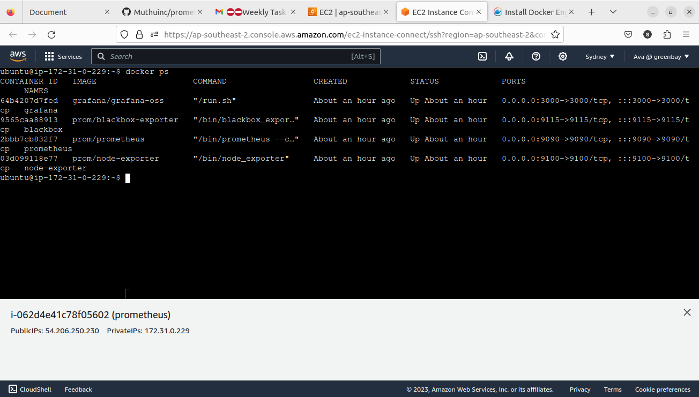

#### Monitoring the application is very essential for the continuous and seamless operation of any business. It helps in address issues in real-time, thereby minimizing disruptions and maximizing productivity.

### Prometheus and Grafana
  - There are several ways to install it application among that Installing through Docker is an effective and simplest one.
  - In the same repository i have the Docker-compose file which pulls and respective latest docker images.
  - Also have the default configuration files for promethesu and grafana.

```
docker-compose up -d
```

  
  
  - Prometheus is up and running.


  - Grafana is up and running.  

    
  
  ---

### Metrics Collection and Visualization

  - Open the prometheus.yml file and the chanhe the IP address of the server we want to monitor.  
    
  - Prometheus now able to scrape the metrics from the endpoints.  
  - Below is the the application server status.
    
    
    
---
  
### Alerts and Notifications

  - I configured the email notifications settings in the grafana.ini file.
    
  - Test notification has been received.
  .
  - An alert is set for the application server whenever it goes down it will notify. 
  - The application server is stopped to check for the alerts.  
  
  - Grafana sent out an alert email regarding the application along with the dashboard.
  


#### Monitoring, including the use of Prometheus and Grafana, is essential for maintaining operational excellence and responding effectively to challenges.
